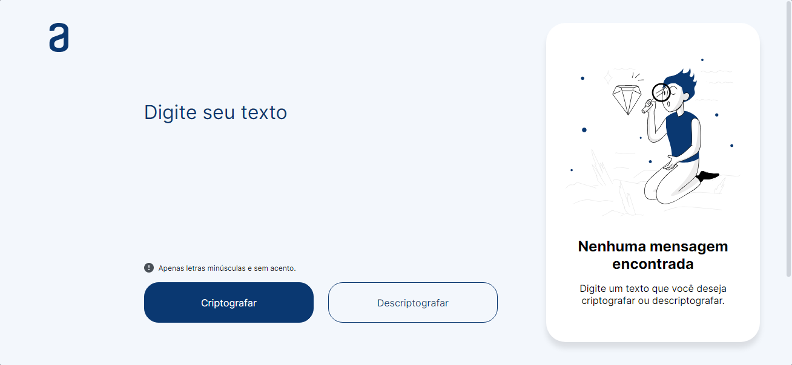

# 🧠 Decodificador 🧠

O "Decodificador" é uma aplicação desenvolvida para criptografar e descriptografar mensagens. Este projeto é uma iniciativa conjunta da Alura, renomada plataforma de educação tecnológica, e da Oracle Next Education (ONE), programa educacional da Oracle voltado para a formação de novos talentos na área de tecnologia. Com o "Decodificador", os usuários podem se divertir com seus amigos mandando mensagens secretas.

## 👩‍💻 Criptografar

Para criptografar uma mensagem usando o Decodificador, siga estas etapas simples: na caixa de texto onde está escrito "Digite seu texto", insira sua mensagem, garantindo que todas as letras estejam sem acentuação e sem utilizar letras maiúsculas. Em seguida, clique no botão "Criptografar". A sua mensagem criptografada será exibida imediatamente no campo de mensagem, agora é só mandar a mensagem para seus amigos decodificarem.

## 👨‍💻 Descriptografar

Para descriptografar uma mensagem usando o Decodificador, siga estas etapas simples: na caixa de texto onde está escrito "Digite seu texto", insira a mensagem criptografada que você deseja decodificar. Em seguida, clique no botão "Descriptografar". A sua mensagem original será exibida imediatamente no campo de mensagem, permitindo que você leia o conteúdo de forma clara e acessível.

## 🎨 Mudar a cor

Para mudar a cor do Decodificador, clique na logo da Alura para abrir o menu de cores. Depois, basta clicar em uma das cores disponíveis para personalizar a aparência da aplicação de acordo com sua preferência.

---
Diverta-se com seus amigos 👍

👉 Projeto [Decodificador](https://diogowi.github.io/challenge-decodificador/)
### Feito por [Diogo Willian](https://github.com/DiogoWi)
